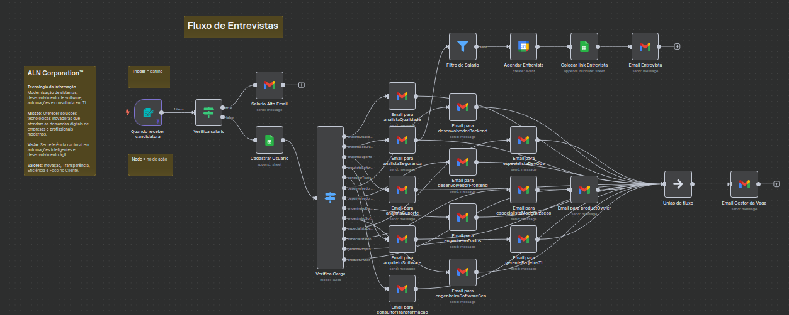
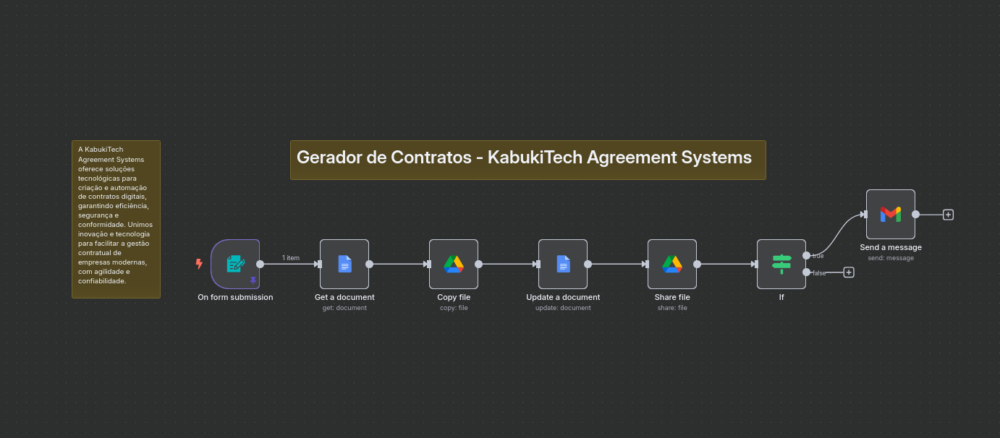

# n8n Flows Collection

Repositório com exemplos práticos de automações desenvolvidas no [n8n](https://n8n.io/), uma plataforma open-source para automação de fluxos de trabalho (workflows). Os fluxos aqui presentes servem como ponto de partida para criação de sistemas automatizados em diferentes contextos.

---

## 📁 Conteúdo disponível

- Arquivos `.json` exportados diretamente da plataforma n8n, prontos para importação e uso imediato.
- Capturas de tela (prints) que ilustram visualmente o funcionamento dos fluxos, facilitando a compreensão da lógica aplicada.
- Descrições resumidas dos projetos, explicando seus objetivos, funcionamento e possibilidades de adaptação.

---

## 🚀 Primeiro projeto: Fluxo de Entrevistas

Este fluxo tem como objetivo automatizar o processo de recrutamento, desde o recebimento da candidatura até a notificação final dos responsáveis. Ele é ideal para empresas de tecnologia ou equipes de RH que desejam padronizar e acelerar seu processo seletivo.

### 🔧 Funcionalidades principais:

- Captura de informações de candidatos via formulário.
- Verificação automática da expectativa salarial.
- Cadastro dos dados do candidato em uma planilha.
- Roteamento de e-mails personalizados com base no perfil profissional.
- Agendamento automático de entrevistas e envio de link ao candidato.
- Notificação final ao gestor da vaga com os dados centralizados da candidatura.

### 🎯 Objetivo

Evitar tarefas manuais repetitivas, organizar o processo seletivo de forma escalável e melhorar a comunicação entre recrutadores e gestores técnicos.

### 📸 Ilustração do Fluxo

---

## 🚀 Segundo projeto: Gerador de Contratos

Este fluxo tem como objetivo automatizar a criação, personalização e envio de contratos digitais para clientes, utilizando integrações com Google Drive e Gmail. Ele é ideal para empresas modernas que desejam agilizar seu processo contratual com segurança e confiabilidade.

### 🔧 Funcionalidades principais:

- Recebimento de informações de um formulário online.
- Localização e obtenção do documento modelo no Google Docs.
- Criação de uma cópia personalizada do modelo para o cliente.
- Atualização dinâmica dos dados no documento copiado.
- Compartilhamento do arquivo gerado via Google Drive.
- Verificação condicional para decidir se uma mensagem de notificação será enviada.
- Envio do contrato para o cliente via e-mail.

### 🎯 Objetivo

Eliminar tarefas manuais na geração de contratos, aumentar a eficiência e reduzir erros no processo de gestão contratual, unindo inovação tecnológica com agilidade e segurança.

### 📸 Ilustração do Fluxo

---

## 👤 Sobre o Desenvolvedor 

<table>
  <tr>
    <td align="center">
      <a href="https://github.com/0nF1REy" target="_blank">
         
        <b>Alan Ryan</b>
      </a>
      

        ☕ Peopleware | Tech Enthusiast | Code Slinger ☕ 
        Apaixonado por código limpo, arquitetura escalável e experiências digitais envolventes.
      

      

        Conecte-se comigo:
      

      

        
        
        
        
      

    </td>
  </tr>
</table>

---
